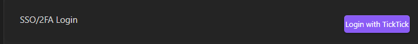

# Troubleshooting

## Settings → Maintenance

Most issues can be resolved through the **Maintenance** tab in TickTickSync settings:

| Tool | Purpose |
|------|---------|
| **Manual Sync** | Force an immediate sync cycle |
| **Check Database** | Scan for synchronization errors or inconsistencies |
| **Debug Options** | Enable verbose logging and view the [sync journal](../configuration/debug-options.md#sync-journal) to trace operations |
| **Backup** | Export your TickTick data as a CSV backup |

## Common Issues

### Duplicate Projects in TickTick

If TickTickSync detects duplicate project/list names, it will show a warning and pause synchronization until the duplicates are resolved. Rename or merge the duplicate lists in TickTick.

### Tasks Not Appearing in Obsidian

1. Go to **Settings → Maintenance → Check Database**
2. Verify the task has the `#ticktick` tag
3. Check if a limiting tag/project is blocking the task
4. Try **Manual Sync**

### Known Platform Quirks

- **Edits made via TickTick's API don't update the task's modification timestamp** — this includes this plugin's own push to TickTick, and any other API/automation tooling. Since sync detection relies on that timestamp, such an edit may go unnoticed by delta-based sync on *other* devices/clients (the device that made the edit already has the correct local state, so it isn't affected). Edits made directly in the TickTick app aren't affected — its own timestamp updates normally.
- **All-day dates are computed using the device's local timezone, not the task's own TickTick timezone**, when pushing a date change from Obsidian. TickTickSync always sends an explicit timezone alongside the date (never a blank or wrong hardcoded one) — but if your device's timezone differs from your TickTick account's timezone, the date value itself can still shift by a day.

### Login Issues

- For SSO/2FA accounts on desktop, use the web login option 
- For mobile, ensure you've logged in on desktop first and synced your vault
- Try changing your home server region if authentication fails
- If TickTick returns `Error 429: Too many requests`, use the web login option. 

### Shared Vaults (Desktop + Mobile)

If you share a vault between desktop and mobile:

- Use the same vault structure and TickTickSync settings everywhere
- Differences in folders, default files, or default projects will cause unpredictable results
- If using file-syncing tools (e.g., Syncthing), resolve sync conflicts promptly to avoid task duplication
